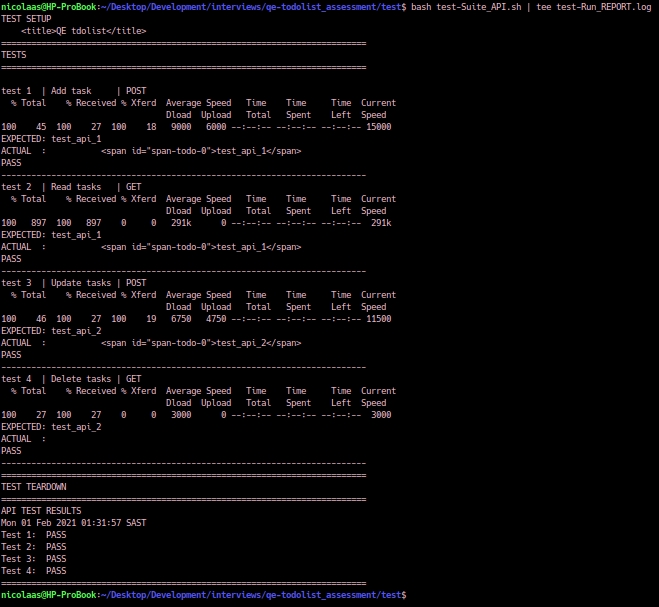
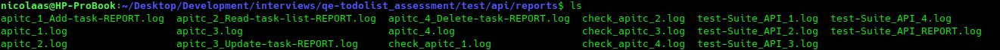

# ASSESSMENT TEST PLAN
Project: qe-todolist_assessment

Created: 29 January 2021

Author: Nicolaas J. Kotze

# INTRODUCTION
This Test Plan coveres FRONTEND as well as BACKEND. 
The purpose of the Test Plan (TP) is to provide an overall test planning and test management document for multiple levels of test within this project.

# OBJECTIVES
. |                      | 
--|----------------------|---------------------------
1. Prevent Defect        | Through active early testing activities.
2. Verify Requirements   | To determine if we are building the product right.
3. Validate Suitability  | To determine if we are building the right product for our users.
4. Build Confidence      | Through active monitoring activities throughout the SDLC.
5. Reduce Risk(s)        | Through active quality processes, testing, and control activities throughout the SDLC.
6. Provide Information   | Through active monitoring to enable information risk-based decisions.

# SCOPE
ID | REQUIREMENT | STATUS
-- | ------------- | -------------
1  | Application must be able to deploy in docker | Done
2  | Multiple users should be able to view the shared public todo list (no live updates, only on refresh) | Done
3  | Todo list items should persist after browser refresh | Done
4  | Todo items should not be able to be empty | Done
5  | Should be able to add todo items | Done
6  | Should be able to delete todo items | Done
7  | Should be able to edit todo items | Done
8  | The application (frontend only) should be ported to Cordova and run as a mobile application. | IN PROGRESS
9  | The application backend should run in Kubernetes on a 3 node cluster with multiple replicas of each pod. | TBD
10 | Should be able to do rolling updates on the backend service without downtime | TBD
11 | Application should be self healing after network issues, node outages, node restarts and other issues | TBD

# RISKS
ID | SEV | TITLE
-- | --- | -------------
1  |  ?  | Fail to deploy resulting in no use or instability.
2  |  ?  | Out of date configurations resulting in security and maintainability challenges.
3  |  ?  | Not meeting the user's need of a basic todo application.
4  |  ?  | Accuracy of information or instability due to multiple users managing tasks.
5  |  ?  | Performance and stability degradation due to excessive resource utilisation.
6  |  ?  | Incomplete and/or not sufficient information to investigate and resolve failures resulting in regression and bad user experience.
7  |  ?  | Loss of data due to instability, restriction, or crash thus lowering confidence in the value of the product.

# APPROACH
A staged approach applying combinations of test strategies.

|Stage       | Summary                                                                               |
|------------| ------------------------------------------------------------------------------------- |
|**Stage 1** | Adhoc and Exploratory-based to find the most obvious bugs and get them resolved fast. |
|**Stage 2** | Formalise test cases using requirements-based testing.                                |
|**Stage 3** | Automate tests and bugs that can be automated based on regression-averse based testing|

# TEST INTEGRATION WITH SDLC
TBD

# METRICS
The following metrics are recommended for monitoring and control to support the objectives of testing:

1. Percentage of planned work done in test case preparation
2. Percentage of planned work done in test environment preparation
3. Test Case Execution
4. Defect Information
5. Test Coverage of Requirements
6. Test Coverage of Risks
7. Test Coverage of Code
8. Test Efforts (burnup)
9. Test Budgets (burnup)

# REPORTING
The following reports or combinations of them are recommended to support the objectives of testing:

1. Summary of testing performed
2. Information on what occurred during a test period
3. Deviations from plan, including deviations in schedule, duration, or effort of test activities
4. Status of testing and product quality with respect to the exit criteria or definition of done
5. Factors that have blocked or continue to block progress
6. Metrics of defects, test cases, test coverage, activity progress, and resource consumption.
7. Residual risks
8. Reusable test work products produced

# WHAT TO TEST
## TEST DESIGNS
See [TESTS.md](TESTS.md) for Test Cases related to the Test Designs.

ID | REQ.ID | RISK.ID | QUALITY     | TITLE 
-- | ------ | ------- | ----------- | -------------
1  | 1, 3   |   1     | portability | Verify installing on Docker related infrastructures.
2  | 2      |  1,2    | security    | Verify basic security.
3  | 2, 3   |  3,4    | feature     | Verify accuracy page updates.
4  | 4, 5   |  3,4    | feature     | Verify task creation functionality.
5  | 6      |  3,4    | feature     | Verify task deletion functionality.
6  | 7      |  3,4    | feature     | Verify task update functionality.
7  | 7      |   6     | usability   | Verify understanding of messages during CRUD processes.
8  | 7      |   7     | reliability | Verify recoverability of tasks after failure.
9  | 8      |  1,2    | portability | Verify installing on mobile devices.
10 | 8      |   3     | usability   | Verify basic user friendly operation on mobile devices.
11 | 8      |  3,4    | feature     | Verify public sharing on mobile devices.
12 | 8      |  4,5    | efficiency  | Verify perfomance on mobile devices.
13 | 8      |   5     | efficiency  | Verify resource utilisation on mobile devices.
14 | 8      |  3,4    | feature     | Verify suitability of application.

# TOOLS
_Refer to the internal wiki for latest information and related instructions such as manuals._

The tool selection primary motivation is to keep it as standard and low resource as possible. Typical rule of thumb, if it is struggle to run on a RaspberryPi Zero, keep searching. The reason behind this is to keep things simple and lower the risk cost of configuration maintenance such as libraries, training, onboarding, and dependencies.

## Node
https://nodejs.org/en/

Required to run the web app. Node.js is a JavaScript runtime built on Chrome's V8 JavaScript engine.

## Docker
https://www.docker.com/

Required to host the Node.js instance. The preferred choice for millions of developers that are building containerized apps.

## cURL
https://curl.se/

**BACKGROUND:**

curl is used in command lines or scripts to transfer data. It is also used in cars, television sets, routers, printers, audio equipment, mobile phones, tablets, settop boxes, media players and is the internet transfer backbone for thousands of software applications affecting billions of humans daily. curl is totally free, open and available. 
Some operating systems ship curl by default. Some do not.

**PURPOSE:**

API testing

## Text Editor
There is no standard so what ever feels comfortable. Common tools are Microsoft Visual Studio Code, VIM, Kate, Notepad++, etc.

# CONFIGURATIONS
To properly support testing, configuration management may involve ensuring the following:

1. All test items are uniquely identified, version controlled, tracked for changes, and related to each other.
2. All items of testware are uniquely identified, version controlled, tracked for changes, related to each other and related to versions of the test item(s) so that traceability can be maintained
throughout the test process.
3. All identified documents and software items are referenced unambiguously in test documentation.

## Test Environment Configuration
- Install Node.js (https://nodejs.org/en/)
- In the project root folder, run `npm install`

## Runing the application in node.js
- Run `node app.js` in the project root folder
- Visit http://localhost:8080 in your browser

## Running the application in docker
- Install Docker: https://docs.docker.com/.
- To build docker image: `docker build -t qe-todolist .`
- To run docker image: `docker run -p 8081:8080 -d qe-todolist`
- Navigate to `http://localhost:8081` to see the app running in docker.
- To stop docker image: `docker ps` grab the Container ID corresponding with the 'qe-todolist' image then `docker stop ${ContainerID}` with `${ContainerID}` replaced with the actual value.

# HOW TO EXECUTE TASKS

## MANUAL TESTS
Manual tests can be found in the folder _"test/cases"_

Filename follow a simple naming convention to improve searching and identification.

tc_#_lvl_type_mobi_title.md

| | |
|-|-|
|tc| test case |
|#| unique identifier represented with a number |
|lvl| test level sl=System al=Acceptance |
|type| strategy related. e2e=End-2-End req=requirement |
|mobi| when present represent that it's for mobile devices|
|title| short descriptive title of the test |

During execution complete the following areas of the test case:

* DATE (At start)
* RESULT (At end)
* Notes (At end if relevant)
* Execute : Actual (during execution)
* Execute : Result (during execution)
* Execute : Comment (bug id and other information that is relevant)

## API TEST
API tests use a combination of bash and curl.

**LINUX**

1. Check all comments mark with an * character in the "test-Suite_API.sh" file and modify accordingly.

Steps:

1. Navigate to the folder "test/api/".
2. Run the bash script _"$bash {filename}.sh | tee reports/{filename}_REPORT.log"_ 
3. Log files and run reports can be found in the folder _"test/api/reports"_

NOTE: "tee" will print the tests to screen and to file.

_Example Output:_

_Example Reports:_

---
# CLASSIFICATIONS
## SEVERITY

Use the following classification for the severity of bugs and basic risks.

** S4 = Critical**
The bug affects critical functionality or critical data and there is no workaround (no way to avoid it). A critical issue affects a very large percentage of users (> 60%) and matches at least one of the following:

 * It can lead to data loss, introduce a security vulnerability or break the automatic end to end tests
 * It prevents the essential product operations or puts your business at great risk

A critical issue should result in a patch version that should be released as soon as possible.

Examples:

 * Difficulty accessing the front office or back office (significant slowdown, error during installation or update, fatal error)
 * Difficulty to globally manage categories, products or customers
 * Difficulty to globally place and manage orders

** S3 = Major**
The bug affects major functionality or major data and there is a workaround, but it is not obvious or can be difficult to put in practice.

A major issue affects a large percentage of users (> 30%) and matches at least one of the following:

 * It impacts law compliance
 * It has a strong impact on the usability of the front-office / back-office or blocks another project
 * It is an important problem but not necessarily blocking the main activity of the seller

Examples:

 * Being unable to add, configure or delete a theme or a module
 * Difficulty in operating a module properly
 * Impacts the price the customer pays

** S2 = Minor**
The bug affects minor functionality or non-critical data and there is a reasonable workaround, even if it can be annoying when using your shop.

Examples:

 * A tolerable slowdown
 * A display problem that prevents users from doing something non-critical (eg: can’t click on an element that can be accessible in another way)
 * An error message displayed in your back-office that can be dismissed
 * Cloning a product doesn’t copy all of it’s data
 * Inaccurate statistics

** S1 = Trivial**
The bug does not affect any functionality or data. It does not impact productivity or efficiency. It is only an inconvenience without functional impact and it does not even need a workaround.

Examples:

 * Cosmetic issues
 * Wrong translation in a specific language
 * Missing confirmation message after an action
 * A link opened in the same tab instead of a new tab

## PRIORITY

Use the following classification for the priority of tasks and activities.

** P4 = Urgent**
Drop everything else and focus on this. Frequent status updates are required.

** P3 = High**
If there are no urgent priorities, do these and resolve ASAP in the allocated time. Status updates as per project plan.

** P2 = Medium**
If there are no urgent priorities, do these and resolve ASAP in the allocated time. Status updates as per project plan.

** P1 = Low**
If there are no urgent priorities, do these and resolve ASAP in the allocated time. Status updates as per project plan.

## TEST CASE STATUS
** DRAFT**

** REVIEW**

** READY**

** DEPRECATED**

## TEST CASE RESULTS
** TODO**

** IN PROGRESS**

** PENDING**

** BLOCKED**

** FAIL**

** PASS**

** ACCEPTABLE**

** QUESTIONABLE**

# REFERENCES
* ISTQB Glossary
* IEEE29119-3 : Software test documentation
