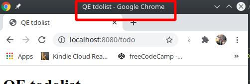

**TITLE**       : Spelling error of application name in titlebar.

**SEVERITY**    : 1 - Trivial

**TYPE**        : Usability

**COMPONENT**   : User Interface

**TEST LEVEL**  : System Testing

**DATE FOUND**  : 01-02-2021

**DESCRIPTION** : The title in the titlebar is misspelled based on the domain intuition that everywhere else it is "todo" and the purpose of the application is to manage todo tasks. This may confuse the user when navigating browser tabs or even when using the OS' process manager.

**EXPECTED**    : Correct spelling "QE todolist"

**ACTUAL**      : Incorrect spelling "QA tdolist"

**STEPS**       :

Precondition: Application is deployed and running under normal conditions.

1. Navigate to the URL "http://{servername}:{port}/todo"
2. Observe the title in the browser titlebar and tab.

**SOURCE**      : file "todo.ejs" Line 5

**ATTACHMENTS** : none

**SCREENSHOT**  :

